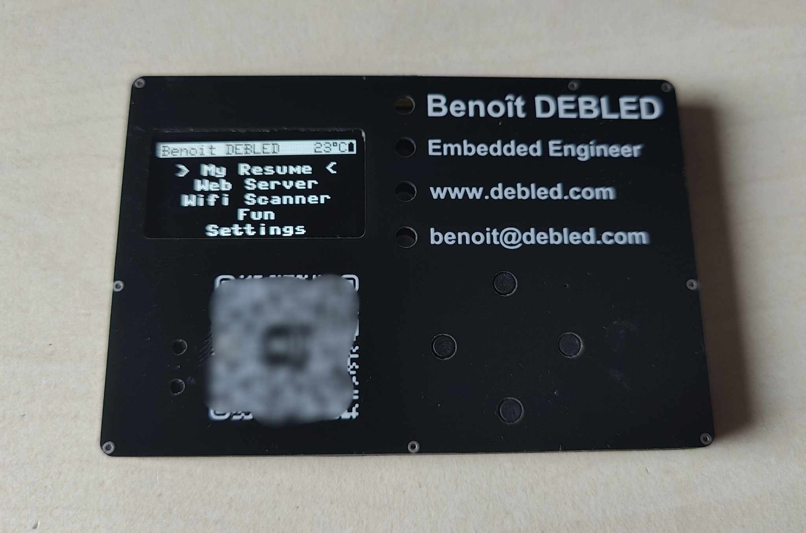

# pcb-business-card-micropython

Paper business cards have long been a staple of professional networking, but in today's digital age, they can feel a bit outdated. PCB business card is a more dynamic and innovative alternative that showcases your creativity and technical prowess. While paper business cards are traditional and functional, PCB business cards are undeniably more intriguing, making a lasting impression with their unique blend of design and functionality.



## Requirements 

Here are the main requirements and features:

1. Usefulness: The PCB business card must break the mold of traditional business cards, ensuring it remains relevant and does not end up in a drawer, forgotten. To achieve this, it will incorporate a range of practical features.
2. Cost-Efficiency: Keeping the project within budget is essential. By selecting cost-effective components and optimizing the design, the aim is to strike a balance between functionality and affordability.
3. Self-Contained Operation: The business card will operate independently, without the need for external devices or connections. It should function as a standalone device, enhancing its versatility and usability.

## Key Features:

* ESP32 Microcontroller: The heart of the card, offering Wi-Fi and Bluetooth capabilities, making it versatile for various projects. Its compatibility with MicroPython allows for easy adaptation.
* OLED Screen Display: A small, yet informative screen to showcase a resume or any other relevant information. A screen is always a valuable addition to any portable project.
* Navigation Buttons: Intuitive buttons for easy screen navigation, ensuring a seamless user experience.
* Temperature Sensor: Practical for various applications, such as a portable thermometer or climate data logging.
* Addressable LED: Adding visual appeal and functionality, the LED can display notifications, status updates, or even be used for creative effects.
* Buzzer: Provides audio feedback, enhancing user interaction and versatility for applications like alarms or notifications.
* Battery-Powered: The card will run on a compact, rechargeable battery LIR2450 , eliminating the need for constant external power sources. This feature allows it to be showcased independently and used in various scenarios, such as a remote control or portable game console.
* Header Pins: Including header pins allows the card to be easily integrated into other projects, extending its functionality beyond a business card.
* MicroPython: MicroPython will accelerate the development process, bringing this project to fruition more efficiently, while also facilitating seamless future firmware customization.

## Component selection

* ESP32-C3: ESP32-C3 is one of the smallest ESP32 chip series, allowing a reduced cost of the project. A module containing the USB-C connector, an LDO regulator, an ESP32-C3, antenna, 2 buttons and breakout pins is used in order to accelerate the development process.
* SSD1306 OLED Screen: This screen is one of the most famous OLED screen in hobbyist projects. The OLED technology will allow a small power consumption.
* WS2812b leds: Those adressable LEDs are affordable and allows to have multiple colors making this PCB business card more versatile
* buttons: regular smd buttons are used in this project. They will be flushed to the top surface making a nice finish. Unfortunately, the ESP32-C3 does not have any touch capable pins making touch buttons more of a hassle as external components necessary.
* passive piezzo buzzer: a very small (5*5*2mm) passive piezzo buzzer will allow multiple tones making it more versatile
* LIR2450 battery: a 120mAH LIR2450 battery will be soldered directly to the PCB without any battery holder in order to gain space
* DS1621 Digital Thermometer: this temperature sensor will give more accurate results than the embedded temperature sensor of the ESP32

## Project structure

This repository contains different folders:

* pcb: contains the different designed PCB using Altium Designer
* src: contains the MicronPython code

## How to make the hardware

* Please produce the 3 different PCB needed for this project: the mainboard, the middle and the top. As the LIR2450 battery is 5mm high, you will need 4 PCB of 1.6mm thick for the middle PCB. There are 3 zip files containing the gerber files; one for each PCB.
* Unsolder the regulator on the ESP32 module. This can be done easily with a hot air gun.
* Solder all components on the mainboard.
* Either connect all PCB by soldering a pin on each visible via or by gluing them together with contact glue. If you choose the glue option, you can still use the via to guide the PCB correctly on top of each other.

## How to deploy the firmware

See [doc/firmware.md](doc/firmware.md) for more details

## How to deploy the micropython app

You can list, get and upload new python file using ampy. To install ampy, please run the following command:

```bash
pip3 install adafruit-ampy
```

To list files, you can run:

```
ampy -p /dev/ttyACM0 ls
```

You should get the following results:

```
/app_secrets.py
/benoit-debled-resume.pdf
/boot.py
/buttons.py
/colorsys.py
/config.py
/display.py
/ds1621.py
/index.html
/led_effect.py
/main.py
/menu.py
/microdot.mpy
/microdot_asyncio.mpy
/music.py
/numberfacts.py
/pong.py
/power_mgmt.py
/resume.py
/settings.py
/sh1106.py
/statemachine.py
/static
/temperature.py
/tetris.py
/webserver.py
```

To deploy the files, run `upload_all.sh`

## Yet to test:

* Small PCB were glued vertically between LED lights to avoid any light bleed. However, LED pipes should be placed. A cheap solution to test is to pour transparent silicone inside the fours LED holes.
