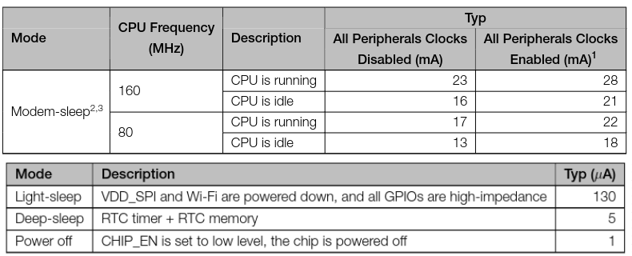
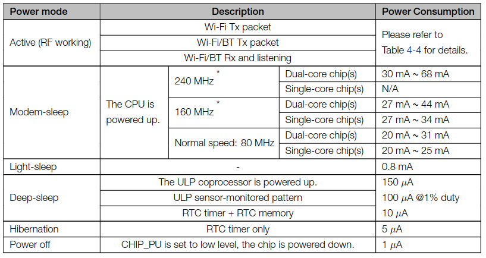
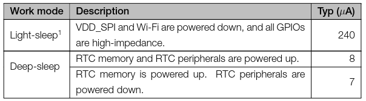
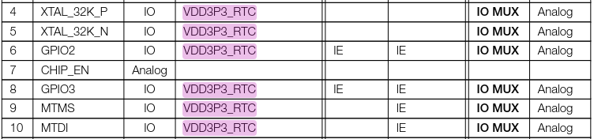
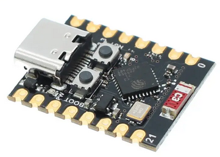
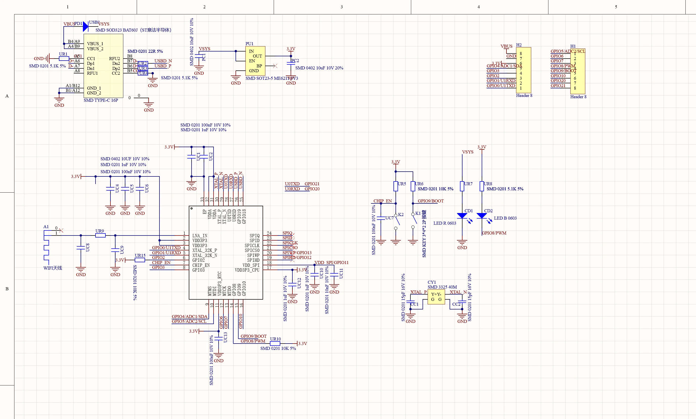

# Micro-controller analysis

## Introduction

As stated in the readme.md of the roof of this project, the selected micro-controller should have the following requirements:

* Not only useful for this business card, but also useful for any future use
* cost should not be too high

It is also best if the micro controller does not require a lot of external components in order to eventually reduce the cost and also to reduce the pcb footprint and hassle

For those reasons, ESP32 chip family seems to be a good choice: it has small footprint, not too expensive, has a lot of features such as WiFi, BLE,... Moreover, some of them have an onboard flash and USB making it very small

## ESP32 Chip series comparison

The ideal chip would then be a chip that has USB, onboard flash and small current consumption particularly on sleep mode.

Let's first understand the differenc chip series. [This](https://core-electronics.com.au/guides/esp-32-naming-conventions/) website is quite an help to understand the overall differences:

```
    ESP32-SX versions are the most powerful, most current version of these ESP32 boards that are readily available. These boards may or may not have Bluetooth connectivity.
    The S3 variant in particular are built with Edge AI machine-learned systems in mind.  Edge just means all calculations are done on the hardware, not the cloud, check out the ESP32-S3.
    ESP32-CX versions are the Low Power, Lower Peripheries (IO) boards. They are usually drop-in replacements for the original ESP8266 Module. The ESP8266 Module started production all the way back in 2014. These have Bluetooth and WiFi connectivity. Perfect for battery-powered remote systems where a low current draw for a long life is ideal. A great example of this would be the ESP32-C3.
    ESP32-HX versions are coming soon. Espressif is always innovating and producing new solutions to stay in front of the curve. These are oriented towards IoT applications, the H2 features onboard Zigbee. We try to stay on top as well and as such it is worth noting the ESP32-H2 will be available in the very soon future. This will be the next most powerful ESP32 Board.
```

Seems like an ESP32-C3 is the ideal candidate as it is a chip from the C-series, hence the low power series! The ESP32-C3 has onboard flash, onbaord USB and is very inexpensive,... It can be seen as the next generation of the ESP8266 [[ref](https://hackaday.com/2021/02/08/hands-on-the-risc-v-esp32-c3-will-be-your-new-esp8266/)]

Let's see the ESP32-C3 datasheet compared to the other ESP32 chip series:



When the device will be sitting, we should be able to get as low as 5µA which is very good!

On an original ESP32, deep-sleep can go as low as 10µA or can go down to 5µA (hibernation):



On the ESP32-S3, deepsleep can go as low as 7µA:



The following table [[src](https://www.espboards.dev/blog/esp32-soc-options/)] explains very well the differences between the different ESP32 versions

|                      | ESP32                      | ESP32S2                      | ESP32S3                    | ESP32C2                  | ESP32C3                  | ESP32C5                  | ESP32C6                   |
| -------------------- | -------------------------- | ---------------------------- | -------------------------- | ------------------------ | ------------------------ | ------------------------ | ------------------------- |
| **Release date**     | 2016                       | 2020                         | 2020                       | 2022                     | 2020                     | 2022                     | 2021                      |
| **Processor**        | Xtensa dual-core 32bit LX6 | Xtensa single-core 32bit LX7 | Xtensa dual-core 32bit LX7 | 32bit single-core RISC-V | 32bit single-core RISC-V | 32bit single-core RISC-V | 32bit single-core RISC-V  |
| **Frequency**        | 240 MHz                    | 240MHz                       | 240 MHz                    | 120 MHz                  | 160 MHz                  | 240 MHz                  | 160 MHz                   |
| **SRAM**             | 520 KB                     | 320 KB                       | 512 KB                     | 272 KB                   | 400 KB                   | 400 KB                   | 512 KB                    |
| **ROM**              | 448 KB                     | 128 KB                       | 384 KB                     | 576 KB                   | 384 KB                   | 384 KB                   | 320 KB                    |
| **Flash**            | Up to 4 MB                 | Up to 4 MB                   | Up to 8 MB                 | Up to 4 MB               | Up to 4 MB               | Up to 4 MB               | Up to 4 MB                |
| **WiFi**             | 802.11 b/g/n, 2.4 GHz      | 802.11 b/g/n, 2.4 GHz        | 802.11 b/g/n, 2.4 GHz      | 802.11 b/g/n, 2.4 GHz    | 802.11 b/g/n, 2.4 GHz    | 802.11 ax, 5.0 GHz       | 802.11 ax, 2.4 GHz        |
| **Bluetooth**        | BLE 4.2                    | x                            | BLE 5.0                    | BLE 5.0                  | BLE 5.0                  | BLE 5.2                  | BLE 5.3                   |
| **GPIO**             | 34                         | 43                           | 45                         | 14                       | 22                       | 20                       | 30                        |
| **ADC**              | Two 12-bit, 18 channels    | Two 13-bit, 20 channels      | Two 12-bit, 20 channels    | One 12-bit, 5 channels   | Two 12-bit, 6 channels   | One 12-bit, x channels   | One 12-bit, 7 channels    |
| **DAC**              | Two 8-bit channels         | Two 8-bit channels           | x                          | x                        | x                        | x                        | x                         |
| **SPI**              | 4                          | 4                            | 4                          | 3                        | 3                        | 2                        | 2                         |
| **I2C**              | 2                          | 1                            | 2                          | 1                        | 1                        | 2                        | 2                         |
| **I2S**              | 2                          | 1                            | 2                          | 1                        | 1                        | 1                        | 1                         |
| **RMT**              | 8 channels                 | 4 channels                   | 8 channels                 |                          | 4 channels               | 2 channels               | 2 channels                |
| **Touch sensor**     | 10                         | 14                           | 14                         | x                        | x                        | x                        | x                         |
| **Hall sensor**      | 1                          | x                            | x                          | x                        | x                        | x                        | x                         |
| **LCD Interface**    | 1                          | 1                            | 1                          | x                        | x                        | x                        | x                         |
| **Camera Interface** | 1                          | 1                            | 1                          | x                        | x                        | x                        | x                         |
| **Deep sleep**       | 100uA                      | 22uA                         | 7uA                        | 5uA                      | 5uA                      | 5uA                      | 7uA                       |
| **Size**             | 5x5mm or 6x6mm             | 7x7mm                        | 7x7mm                      | 4x4mm                    | 5x5mm                    | 5x5mm                    | 5x5mm                     |
| **Other features**   |                            |                              |                            |                          |                          |                          | 802.15.4 (Thread, Zigbee) |

As it can be seen, the C3 is a good choice as we do not need more than a 802.11 b/g/n wifi, BLE 5.0, 400 KB of RAM and 384 KB of ROM. Moreover, as it is the first one of the series, it is one of the most well known variant and is easy to find on the market!

## ESP32-C3 and deepsleep

https://docs.espressif.com/projects/esp-idf/en/release-v4.4/esp32c3/api-reference/system/sleep_modes.html?highlight=sleep

Whereas a lot of wake up methods are available on an original ESP32: wake on timer, wake on touch, wake on ulp, wake on ext0, wake on ext1 it is not the case on the ESP32-C3. Indeed, the only possible way to wake up the ESP32-C3 is through a timer or via the pins that are powered by the RTC:



Note that unlike the ESP8266, the ESP32-C3 can sleep indefinitely until you wake it up via one of those pin. You can also technically configure it to sleep forever without any way to wake up unless you reset it.

The only drawback is that it seems that MicroPython does not support wake up on those pins for the ESP32-C3 as it can be seen in the [modmachine.c](https://github.com/micropython/micropython/blob/5232847771903e9022c8c67a436b0562e4530602/ports/esp32/modmachine.c) file: (look at the `#if !CONFIG_IDF_TARGET_ESP32C3` line...). This is not an issue however as it is not impossible! My first thought was to call the correct calls of the ESP-IDF by either modifying the micropython code or by writing [native machine code in .mpy file](https://docs.micropython.org/en/latest/develop/natmod.html) but I will have a look at a current MicroPython [PR](https://github.com/micropython/micropython/pull/9583)

```c
STATIC mp_obj_t machine_sleep_helper(wake_type_t wake_type, size_t n_args, const mp_obj_t *pos_args, mp_map_t *kw_args) {

    ...
    
    mp_int_t expiry = args[ARG_sleep_ms].u_int;

    if (expiry != 0) {
        esp_sleep_enable_timer_wakeup(((uint64_t)expiry) * 1000);
    }   
    
    #if !CONFIG_IDF_TARGET_ESP32C3

    if (machine_rtc_config.ext0_pin != -1 && (machine_rtc_config.ext0_wake_types & wake_type)) { ... }   
    if (machine_rtc_config.ext1_pins != 0) { ... }
    if (machine_rtc_config.wake_on_touch) { ...  }
    if (machine_rtc_config.wake_on_ulp) { ... }

    #endif

    switch (wake_type) {
        case MACHINE_WAKE_SLEEP:
            esp_light_sleep_start();
            break;
        case MACHINE_WAKE_DEEPSLEEP:
            esp_deep_sleep_start();
            break;
    }
    return mp_const_none;
}

```

## ESP32-C3 chip or module?

In order to increase the development speed, a module will be used. Indeed, there are a couple of benefits:

* no need to go through an assembly process, the module can be hand soldered
* some tests can be done on a breadboard before ordering the PCB (current measurements,...)
* no antenna design to be done

but it has also a couple of drawbacks:

*  a little bit more footprint used
* need to remove the default LDO regulator as the quiescent current is way higher than a good old MCP1700 (for example). Moreover, as we want the device to be battery operated, we might want to add a MOSFET in the middle of this.

Without further ado, here is the ESP32-C3 module:



And here is its schematic:



## Pin usage

As I might do the design without having the ESP32-C3 in front of me due to time constraints, it is very important to check that all pins are correctly used!

Here is a table that summarize the pin usage

| Pins   | Use                                           | Note                                                         |
| ------ | --------------------------------------------- | ------------------------------------------------------------ |
| GPIO0  | Button                                        | VDD_RTC                                                      |
| GPIO1  | Button                                        | VDD_RTC                                                      |
| GPIO2  | Button                                        | VDD_RTC /!\ Strapping pin                                    |
| GPIO3  | Button                                        | VDD_RTC                                                      |
| GPIO4  | Screen/Temp/WS2812B ON/OFF (through 2 MOSFET) | VDD_RTC                                                      |
| GPIO5  | Battery voltage input + USB detect            |                                                              |
| GPIO6  | SCL                                           | /!\ Power glitches (the pin is at a low level output status during 5ns) |
| GPIO7  | SDA                                           | /!\ Power glitches (the pin is at a low level output status during 5ns) |
| GPIO8  |                                               | LED connected /!\ Strapping pin                              |
| GPIO9  |                                               | Boot button /!\ Strapping pin                                |
| GPIO10 | Buzzer (through MOSFET)                       | PWM should be on all GPIO pin /!\ Power glitches (the pin is at a low level output status during 5ns) |
| GPIO20 | WS2812B                                       | /!\ Power glitches (the pin is at a low level output status during 5ns) |
| GPIO21 |                                               |                                                              |
|        |                                               |                                                              |
|        |                                               |                                                              |

This leaves not a lot of free pins! This is one caveat of ESP32-C3: its limited number of pins. There are different solutions if you need more IO: I2C IO expander or shift registers for the cheap way. 74HC166 and 74HC595 are good candidates. Please read this [page](https://diyi0t.com/shift-register-tutorial-for-arduino-and-esp8266/?utm_content=cmp-true) for more information.

Note that the REPL will not be duplicated on UART0 but will only be available through CDC (USB). Indeed, this is well configured in the following file of micropython repository `ports/esp32/boards/GENERIC_C3_USB`: 

```
CONFIG_ESP_CONSOLE_UART_DEFAULT=
CONFIG_ESP_CONSOLE_USB_CDC=
CONFIG_ESP_CONSOLE_USB_SERIAL_JTAG=y
```

## Current analysis

Note on OLED: https://bitbanksoftware.blogspot.com/2019/06/how-much-current-do-oled-displays-use.html

Note on WS2812: https://lowpowerlab.com/forum/general-topics/ws2812b-rgb-led-measurements/

## Conclusion

Long life to the ESP32-C3!


## current analysis

ltc plugged in & q1 plugged in: 44uA in deepsleep

ltc unplugged & q1 plugged in: 7.5uA

ltc plugged on vbus & q1 plugged in: 7.8uA

ltc unplugged. q1 plugged. R5 & R6 plugged with gnd shorted with gnd_on_off : 45uA

me6211 plugged on vsys & q1 unplugged, R5 & R6 unplugged: 77uA

0.608v -> 3.725v

measured 